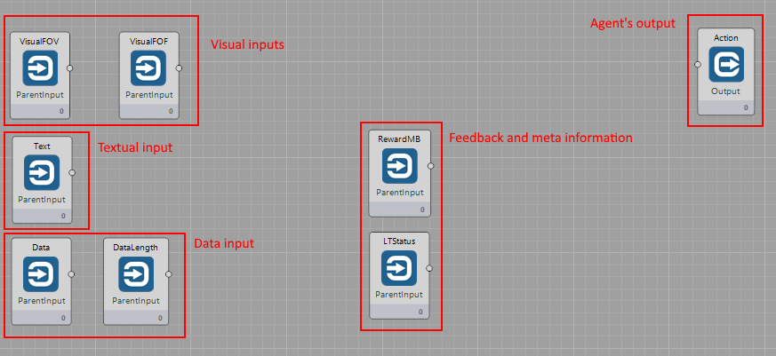
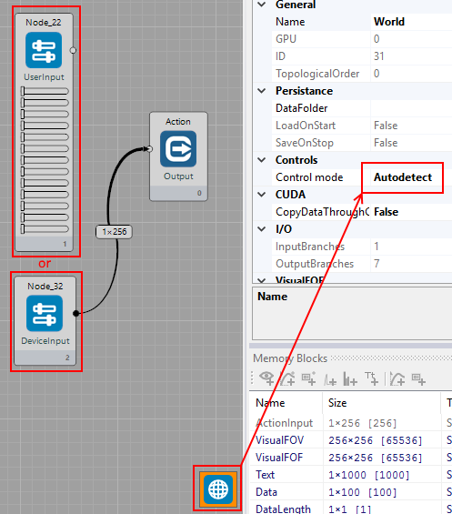

## School for AI

We expect that any AI with ambitions of becoming a general AI needs extensive training. Our School for AI is a place where such training occurs. 

School for AI is a world within BrainSimulator which you can use for training and testing your architectures. The training is separated into learning tasks, which together form a curriculum. A single learning task teaches or tests preferably a single new skill or ability.

The training can occur in a range of environments. We've prepared a basic 2D environment (RoguelikeWorld), an advanced 2D environment (ToyWorld), and a basic 3D environment (3D version of ToyWorld). A single curriculum can train the same architecture on multiple different environments.

The school assumes that the agent's I/O interface is fixed. All the different environments usable in School for AI connect to this interface.

### Basic concepts

Below we provide an explanation of the basic concepts related to School for AI. We explain the terms *learning task*, *training unit* and *curriculum* and we also explain how the learning progress is evaluated. 

#### Learning task

A learning task is a collection of exercises of the same kind that is presented to the Agent in order to teach it to solve a specific problem. For instance, a learning task can teach you to add small numbers, categorize shapes or detect changes in a scene. The exercises the learning task consists of are referd to as *training units*.

#### Training unit

A training unit is a specific instance of the problem that a learning task represents. For instance, if the learning task teaches you the skill of addition of small numbers, then a single training unit can be a problem "5+6=?".

#### Curriculum

A curriculum is a sequence of learning tasks. Multiple curricula can be composed together to form nested curricula.

In our [Agent Development Roadmap](http://www.goodai.com/roadmap), we provide a visual illustration of how a collection of learning tasks could guide the teaching of the Agent with the intention to have it learn gradually. School for AI was designed to make this process possible, fast and convenient.

#### Evaluation

There is no separation of training and testing in School for AI, although it can be extended to allow such a separation. The training occurs online and the agent is tested continually. The default success criterion for declaring a learning task passed is making the correct sequence of actions (choosing the correct behaviour) 20 times in a row. At the same time, by default, the number of shown training units is limited for each learning task. Different success criteria can be chosen - see the Architecture overview below.

### GUI

To use School, start Brain Simulator and select "View->School for AI". Notice that this action will change your current world to School World and open a dedicated School window (see illustration below).   

You will notice that School has a dedicated world, SchoolWorld. It gets selected automatically when you open the School for AI window. As long as you intend to work with School, you should keep this world selected. 
The SchoolWorld provides a fixed set of inputs for your agent and receives a fixed set of outputs from it. This way you can design a single agent architecture that will be subject to rich and varied training in School, using different learning tasks. 

The School window allows you to:

1. Specify the curriculum which your agent will be subjected to,
2. Control the simulation,
3. See what problem (learning task) is being run at the moment,
4. See the current progress of a learning task,
5. See what kind of input data your agent is receiving in the current training unit,
6. See runtime statistics.

#### Curriculum creation

A curriculum is a collection of one or more learning tasks. In the figure above, the section on the left (labeled by number 1), displays four curricula, called respectively "Pong", "RogueLike", "Tetris" and "ToyWorld".
New curricula can be added by clicking the "Curriculum +" button on the top toolbar. New learning tasks can be added to a curriculum by clicking the "Task +" button on the top toolbar. We can see from the illustration that each of the shown curricula contains a number of learning tasks.

#### Progress of training

Sub-window labeled by number 3 in the figure shows the progress of training. The order of learning tasks that is shown is the order in which the learning tasks will be run during the simulation. The highlighted row corresponds to the learning task that is currently running, or, when the simulation is not running, the learning task that the user is viewing. The sub-window also shows what environment (World) the learning task belongs to, the steps that were run run until now for that learning task, the time elapsed from the start of the learning task, the Progress bar and the Status (whether the learning task was passed or not).

#### Learning task details

Given a learning task, you can also view other information about it. Number 4 in the figure above labels difficulty levels that belong to the currently selected learning task. Each level in a learning task can have different parameter values. Number 5 labels an observer that displays the visual data provided by the current training unit. Number 6 labels a section that shows statistics of the currently running learning task.

### I/O

The inputs the world provides to your agent are:

1. Two visual inputs (Field of View - large and low-res; Field of Focus - small and hi-res),
2. Textual input,
3. Data input with a size indication,
4. Feedback through the Reward memory block,
5. Meta-information through the LTStatus memory block (progress in the learning task, number of the learning task).

The output signals the world expects from your agent are all contained within a single memory block, Actions. 
Your agent should connect to the Action memory block using a connection of size 13 at least. The individual actions are:

1. Movement commands (forward, backward, left, right, rotate left, rotate right), 
2. Field of Focus movement commands (fof left, right, up, down), 
3. Interaction commands (interact, use, pickup/drop).

To ease human interaction with the environments in School, you can also connect the DeviceInput node to the inputs of the world. In such case, relevant keystrokes (e.g. WSAD) are converted to 1s and sent to the environment. If you intend to switch between the DeviceInput node and other means of providing input, you should keep the World's control mode at "Autodetect".

### Architecture overview

#### SchoolWorld

School is implemented as a MyWorld node called SchoolWorld. This node has a control window associated, accessible from the menu "View->School for AI". The SchoolWorld is special - it can spawn new worlds during runtime. This property is used for creating the training and testing environments for the agent (RoguelikeWorld, TetrisWorld, ToyWorld, etc.)

SchoolWorld acts as a point of contact for your brain architecture. It provides input to the architecture and receives outputs from it. It then redirects this I/O to the world that was spawned for the current learning task from the curriculum. It also runs the current learning task and switches to the next learning task when the current one is over. Besides acting as an intermediate, School also collects statistics of the training and controls the simulation. For instance, School pauses the simulation if the trained architecture fails to pass a learning task.

#### World Adapters

Any world can be connected to SchoolWorld. To connect a world, you need to include an IWorldAdapter interface in it, preferably by using inheritance. You don't need to register the new adapter anywhere, inheriting the IWorldAdapter interface is enough. The most important tasks of the adapter are to initialize (or release) the connected world and forward the communication from SchoolWorld to the connected world. It may be necessary to convert the transmitted data, hence the "Adapter" name.

#### Switching Worlds

A world is switched (or reset) whenever a learning task is finished and next learning task should be shown. The previous world is released and the next world is initialized (its init tasks are run). The switching occurs within the ChangeModel method of SchoolWorld.

#### Learning task

To create a learning task, you need to know which world it will use. Once that is resolved and your world does have a world adapater ready, you need to specify:

1. What data the learning task will provide within a training unit (method PresentNewTrainingUnit),
2. How many levels the learning task will have and what features the levels will have (constructor of the LT - member TSProgression),
3. What is the success/fail criterion for a training unit (method DidTrainingUnitComplete),
4. What is the success/fail criterion for the learning task (method EvaluateStep, property NumberOfSuccessesRequired).

### Connected worlds

As was said above, you can connect any world to School provided that you write the appropriate World Adapter. The worlds that are connectable right now are:

1. **RoguelikeWorld**: a simple, top-view 2D environment useful for showing basic problems to the agent (e.g. shape detection, visual classification, simple navigation).
2. **ToyWorld**: a more complex, continuous, top-view 2D environment (optionally 3D) for showing advanced, continuous problems to the agent. See the separate documentation page for ToyWorld in the Worlds section.
3. **TetrisWorld**: a world for playing TetrisWorld.
4. **PongWorld**: a world for playing Pong/Breakout.

