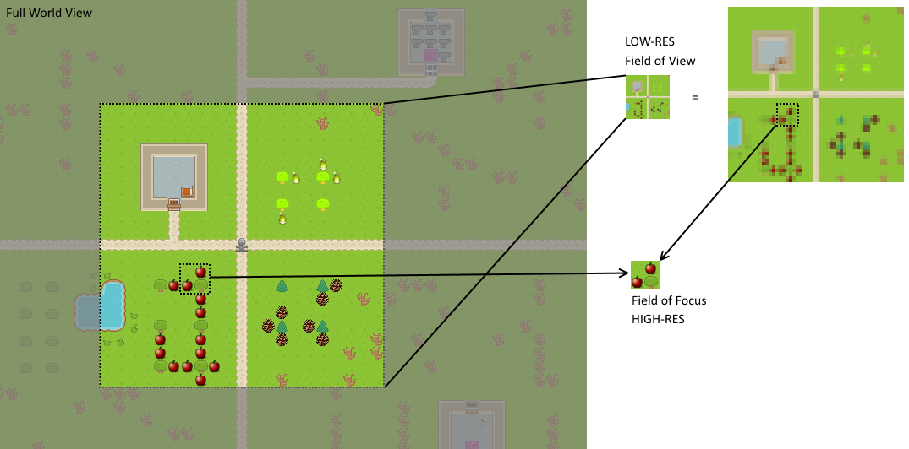
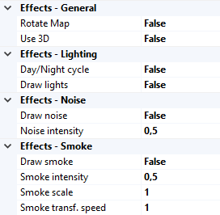
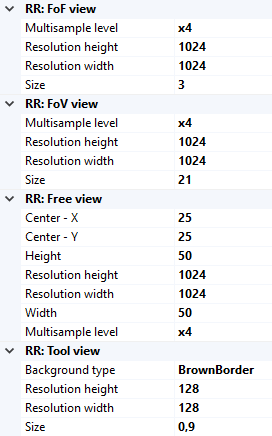

# Toy World

On this page, expect to find both a general user overview and more concrete programmer's insights into what the `Toy World` is and how it is designed, should you want to tinker and bend the code to your liking.

The Toy World is a simple customizable continuous 2D (optionally 3D) environment. It was designed as a test bed for general artificial intelligence agents; the possible complexity of the world enables the experimenters to gradually increase the requirements for the agent's skills. The design decisions were mostly made in favor of rapid world prototyping and easy data transfer between your application and the Toy World core. 

## User part
### World design
The world comprises a grid of voxels; each voxel is a collection of cells, where each cell belongs to a different `Tile Layer` (that is: the world is a cuboid). Every cell can have up to one `Tile` -- this is the actual item that the objects interact with and that gets drawn.

Next to Tile Layers, there are `Object Layers` that span multiple Tile Layers. All `Characters` (objects with movement and custom actions) belong to a specific Object Layer and compute collisions and actions only against other objects or tiles in the corresponding Tile Layers.
          

There are generally different types of Tile Layers, e.g.:

 * a passable layer (grass, gravel, bricks, etc.),
 * an impassable layer (walls, stones, etc.),
 * an impassable interactable layer (doors, switches, etc.), and so on. 

This allows an easier interaction with objects based on the type of layer they are in.

The world has a few interesting tiles and properties ready from the start, e.g.:

 * tree tiles that periodically spawn objects near them (apples, pears, pinecones, etc.) that the characters can eat or transport around,
 * a day/night cycle that darkens the screen in the evening,
 * a summer/winter cycle that periodically covers tiles in snow.

### Character design
`Characters` in Toy World are "a dynamic version of tiles" in that they can move in the environment independently from the grid. They follow the usual physics-based rules like collision with impassable objects (tiles and other characters that share an interval in their layers).

A special class of characters is the `Avatar`. In addition to movement, Avatars can interact with the environment (open doors, pickup objects, eat fruit, etc.). This is the entity in the Toy World core that your application's artificial brain can connect to and send inputs to. This means that you can independently control any number of avatars in the world using any means you desire (a neural network-based learning system or e.g. a simple behavioral tree for lesser avatars).

Each avatar not only accepts inputs based on which it behaves in the environment, but also produces a set of outputs. These are e.g.:

 * some pieces of information about the avatar's current energy and tiredness levels,
 * the contents of its inventory, 
 * the field of view (a generally large but low-res visible area around them) and 
 * a field of focus (a high-res small area within the field of view).

### Brain simulator settings
You can conveniently setup the Toy World using the Brain Simulator's world properties. You can control all global effects and Render Requests' resolutions (more on these in the [render architecture section](#render)).  

There are several not necessarily self-explanatory properties. 

       
#### Effects  
 
    
 * *Rotate map* - should the map be rotated and the avatar remain facing up at all times?
 * *Use 3D* - this is a provisional mode where the scene gets rendered from the avatar's point of view instead. Note that this disables the use of field of focus.
 * *Day/Night cycle* - if enabled, the scene will periodically fade into darkness.
 * *Draw lights* - this is a provisional feature. If enabled, all characters except avatars will emanate light with attenuation based on their current speed of movement. At a later stage, this should be used for ambient purposes (and be re-done).
 * *Draw noise* - A random gaussian noise will be added to each of the RGB channels. The variance of the distribution is influenced by the "Noise intensity" property.
 * *Draw smoke* - The areas between impassable objects will be filled by a semi-transparent fog. This is based on the continuous 3D perlin noise. You can specify the intensity (fog "thickness"), scale (the steepness of the gradient) and the speed of fog's flow.   

 
#### Render requests      

 * *Multisample level* - the amount of subpixels per pixel; they get averaged to produce less jagged edges.
 * *Resolution* - the resolution in which to draw the render request.
 * *Size/Width/Height* - the amount of tiles this render request spans.    

      
#### Runtime

 * *Copy data through CPU* - by default, CUDA-openGL interop is taken advantage of (the data thus stay on the graphics device at all times). On some systems, though, this causes issues; you can thus specify to copy the data to a CPU buffer before copying it further to CUDA memory. 
 * *Copy depth data* - by default, the depth data is not copied back to brain simulator (the corresponding memory blocks thus cannot be used). This enables the transfer at a cost of slightly reduced performance.

## Programmer's part

<!---

### World architecture
How the atlas works (overview)
How to define your own map using Tiled (.tmx) so it works in ToyWorld
How to add a new tile/layer in .tmx so that it works in ToyWorld
How to add a new character in .tmx so that it works in ToyWorld

-->

### API
We provide a rich interface for controlling the Toy World core. The access to core is limited to the `ToyWorldFactory`. The factory lets you get an `IGameController` object (a standard one or a thread-safe variety) that lets you do several things:

 * Register Render Requests - these are used to draw the environment in the selected manner. Call the `RegisterRenderRequest` function and specify the interface of the desired render request as its type parameter. In return, you will be provided with a proxy to the render request that you can use to set up the rendering and collect the data.
 * Get Avatar controllers - you can get an `IAvatarController` to the specified Avatar. Through this object, you can set the Avatar's inputs and query for its status.
 * Issue a game simulation step - all game objects and logic gets processed based on the available setup and inputs and all render requests are resolved. A more detailed description of the game's loop is presented in the [game logic section](#loop).

The usual workflow is as follows:
 
 * create a custom map (using custom tiles/layers/characters),
 * grab a Game controller and provide it with the correct map data, 
 * register the desired Render requests and set them up according to your agent's needs,
 * get an Avatar controller to any number of avatars (that you defined in your map),
 * in a loop,
     * use the Game controller to make a step (see [more details](#loop) about what happens within one step),
     * collect information from the Avatar controllers and Render requests and
     * based on the collected information, let your logic create new inputs for the avatars.

### Render architecture
All drawing logic is managed by a **Renderer** (inheritors of `RendererBase`). Its purpose is to fulfil separate rendering requirements - Render Requests (avatar's field of view/focus, full map view, inventory tool only, etc.) - and to provide specific implementations with access to render resources (textures, geometry, effect shaders and render targets).

Users can ask for any amount of **Render Requests** (RRs) (inheritors of `RenderRequestBase`); each displays the scene differently. For instance the **Avatar Render Requests** (inheritors of `AvatarRRBase`) extend the behaviour by being tied to a specific avatar, the camera follows him around, it draws his inventory etc. There are no connections between different render requests, they are totally independent and have their very own set of framebuffers to draw onto and to copy from. There are several notable RRs ready for use - it is enough to simply get them through a game controller, set them up and collect and process the drawn image after every step.

Every render request uses **Painters** to do the actual drawing (inheritors of `PainterBase`). What you see as settings for the render request are actually settings for the individual painters. Render targets and some fields are shared by all painters of a render request. Every painter has its own copy of objects it needs (shaders, etc.), if it requires specific settings.  

                                
#### Getting data from the RenderRequest
To get a hold of the rendered image, use the `ImageSettings` that are available on every `IRenderRequestBase` object (those you get through the Game controller). There you can hook your callbacks that do something with the images. 
 
Depending on the `CopyMode` setting, either the CPU or the PBO event will be invoked. The CPU callback will give you an array of RGBA values encoded into unsigned ints. The PBO alternative will provide you with an openGL handle to the pixel buffer object that holds the image data. Note that during the callback, the correct openGL context is set, and you can safely map the devices memory (openGL data are shared across all contexts, though; you can thus freely bind your own context).

 
#### Creating custom Render requests
In case you want to define custom render requests, there are a few steps you need to take:

 * create a new interface that (transitively) implements one of the public Render request interfaces (`IRenderRequest`, `IAvatarRenderRequest` or any of their existing implementations),
 * create your implementing class that handles the rendering (note that it **must** implement `IRenderRequestBaseInternal<TWorld>`, where TWorld is the class that handles updating the environment - by default `ToyWorld`) and lastly
 * register the interface and the implementation to the `RenderRequestFactory` (this is by default done in the `ToyWorldRenderer` class that is a renderer specific for the `ToyWorld`) and finally
 * make sure that the `ImageSettings` adhere to the requirements and provide reasonable data to the correct callback.

### Game logic
One step after calling `MakeStep` on the Game controller comprises the following actions: 

 1. \[**I**\] if the core's components are not initialized, it will happen so (`GameControllerBase.Init`),
 2. \[**U**\] the world updates (`ToyWorld.Update`)
     * game time advances,
     * game components that registered for update get updated (provided that the correct number of simulation steps has passed) (`AutoupdateRegister`),
     * characters' movement direction vectors get updated based on the desired inputs (i.e. agent's decisions set through the Avatar controller) (`Physics`),
     * \[**P**\] collisions caused by the desired movement get resolved (`ICollisionResolver`),
     * misc features like the `Atmosphere` get updated,
 3. \[**D**\] draw the render requests (`RendererBase.ProcessRequests`)
     * incorporate any newly added render requests,
     * update the render requests' states,        
     * render the game objects, effects and gather the scene's image.
 4. \[**T**\] At this point, the `MakeStep` is over and the application can query for avatar's statuses and process the rendered images.  
 5. \[**W**\] Wait to reach 16.666 ms before the next frame can begin.

                    
The last point (5.) is not a feature of the Toy world core, but rather a restriction added in Brain Simulator (`ToyWorld.TWUpdateTask`). Your calling of `MakeStep` can provide any other logic necessary.
                     
Please note that everything in this model is *synchronous* (the model used in Brain Simulator); there is no overlapping between frames/parts of a frame - every action in the cycle starts after the previous has finished. This means that you always get images as results of drawing an environment that was updated using your most recent inputs. If you don't mind your agent having data delayed by one step, you can be computing new inputs for the avatar while the Toy World is simulating the last step's inputs.
